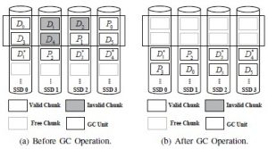

# 容错与灾备系统
如今，数据与国家、公司和个人都息息相关。特别是近年来，全球数据量呈爆发式增长，根据EMC和IDC联合发布的一份研究报告显示，直至下一个十年，数据年增长率大约为40%。预计到2020年，全球每年产生和拷贝的数据将达到44ZB（1ZB为1万亿GB）。存储系统是数据的载体，不断膨胀的数据存储需求导致存储系统规模不断扩张，2017年全球云存储市场规模已达307亿美元，预计2022年将增长致889.1亿美元。然而在数据中心中，每年约有5%的磁盘失效、每日约有0.1%的服务器发生宕机。在出现故障时，为保证数据不丢失且可以正常访问，存储系统必须提供可靠性保障。目前存储系统以存储数据冗余的方式提供可靠性，其中包括：多副本技术与纠删码技术。本课题组针对性能修复优化、SSD RAID、扩容和分布式容错等方面对容错灾备系统进行可靠性研究，相关代表工作介绍如下。
## 修复性能优化

RDP（Row Diagonal Parity）编码是存储系统中最常采用的RAID-6编码之一，它通过在系统中添加两个磁盘的冗余数据来保证任意两个磁盘同时故障时，数据不会丢失。我们研究了基于RDP码的单盘故障修复问题，分析了任意单个磁盘的故障修复过程中，从存活磁盘读取的数据量的理论下界，同时设计了一种混合修复算法RDOR-RDP(Row Diagonal Optimal Recovery-RDP) ，该算法综合利用RDP编码的两类校验，行校验和对角线校验，共同修复单个故障盘中的数据，实现了修复过程中的数据读取量达到理论下界。此外，RDOR-RDP从系统中各存活磁盘读取等量的数据用于故障恢复，从而保证了修复过程中各存活磁盘的负载均衡。理论分析表明，RDOR-RDP在修复过程中的数据读取量与传统单盘修复算法相比减少了将近25%。模拟实验结果表明，与RDP编码的传统单盘修复算法相比，RDOR-RDP的平均磁盘访问时间减少了15%-22%，总修复时间减少了5%-12%。（”Optimal Recovery of Single Disk Failure in RDP Code Storage Systems”, ACM SIGMETRICS 2010.）

## SSD RAID

传统的阵列系统常常采用读-修改-写或读-重构-写机制来进行校验块的更新。但是这两种机制依然会给阵列系统带来许多额外的I/O访问，进而降低固态硬盘阵列系统的性能。近年来，有研究者为固态硬盘阵列系统提出了弹性条带写机制。当数据块需要更新时，该机制将这些需要更新的数据块重构成新的条带，而不是对相应的校验块进行更新。弹性条代写机制能够有效的减少检验块更新带来的开销，然而，它引入了阵列级别垃圾回收操作，这将极大影响固态硬盘阵列系统的性能和寿命。为了解决这个问题，我们首先使用热度感知缓存将进入阵列系统的数据块按照它们的热度值进行划分并缓存进相应的热度组，然后使用分组弹性条带写机制将不同热度组的数据块写入阵列系统的不同区域。为了验证该设计的有效性，我们将热度感知缓存和分组弹性条带写机制部署到由八块固态硬盘构成的RAID-5阵列系统中。实验结果表明，相较于弹性条带写机制，我们提出的机制能够减少26%-65%的阵列级别垃圾回收写操作，将平均响应时间降低到原先的17%-63%，并有助于达到系统级别磨损均衡。（”Grouping-based Elastic Striping with Hotness Awareness for Improving SSD RAID Performance”, IEEE/IFIP DSN 2015.）

## 扩容

随着当前存储系统对容错要求的逐渐提高，考虑容任意错的CRS（Cauchy Reed-Solomon）编码的扩容问题愈发重要。CRS编码主要适用于由众多存储节点以及互联网络组成的分布式存储系统。扩容过程需要迁移部分数据到新的存储设备，同时需要更新校验。数据迁移与校验更新带来的存储I／O与网络传输带宽开销直接影响扩容过程中的系统性能。我们研究了基于CRS编码的分布式存储系统的扩容问题，通过第一步设计扩容后的编码矩阵，第二步设计扩容过程中的数据迁移方案，第三步利用校验解码部分数据的思想进一步优化数据迁移过程，为CRS系统扩容设计了一个三阶段优化扩容算法。理论分析表明，三阶段优化扩容算法相对于基本扩容算法，能有效逐步地减少CRS系统扩容过程中的系统I／O与网络传输带宽。通过在实际的分布式文件系统中部署CRS三阶段优化扩容算法，并与基本扩容算法进行广泛实验对比，证实了算法在单线程以及多线程架构下的有效性与实用性。（”I/O-Efficient Scaling Schemes for Distributed Storage Systems with CRS Codes”, IEEE TPDS 2016.

## 分布式容错

为保证数据访问性能的同时降低系统的冗余存储开销，分布式存储系统通常会采用异步编码技术。在新数据被写入时，系统使用多副本机制对这些数据进行存储，并在数据访问变少后，在后台将这些数据转化为纠删码方式存储。由于分布式系统通常采用随机分布的数据块放置方法，逻辑地址连续的数据块通常会分散在系统的所有节点中。因此在执行编码操作时，编码进程需要通过跨机架下载来获取数据块。而在编码完成后，又需要跨机架的数据块重新分布来保证数据的可靠性。这种方法即降低了异步编码操作的执行效率，也影响系统中前台任务进程的性能。为提高异步编码的执行效率并降低其对前台任务性能的影响，我们提出了一种新型的编码条带构建方式，称之为动态条带构建技术DSC(Dynamic Stripe Construction)。DSC 根据当前系统中数据块的放置信息来组建编码条带。放入同一编码条带中的数据块需要满足以下两种性质：(1)这些数据块存在副本存储于同一机架中，以保证在编码时不会引起跨机架的数据块下载；(2)这些数据块存在副本分散在其他独立的机架中，以保证编码完成后不会引起跨机架的数据块重新分布。为了在庞大选择空间中有效地组建编码条带，我们设计了一种管理数据块放置信息的数据结构，并基于这一数据结构提出了一种线性时间复杂度的动态条带构建算法。该算法可以以热插拔的方式应用于使用任何数据放置方式与纠删码配置的分布式集群。为了验证动态条带构建技术的有效性，我们将DSC实现在HDFS系统上。在真实集群的测试实验中，DSC可以显著的提高异步编码的执行效率(实验中最高改进可达81%)，并降低其对前台任务进程的影响。（”DSC: Dynamic Stripe Construction for Asynchronous Encoding in Clustered File System”,  IEEE INFOCOM 2017.）

