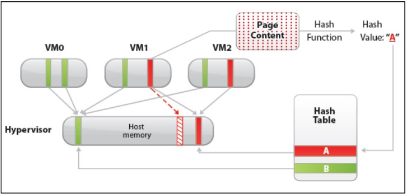
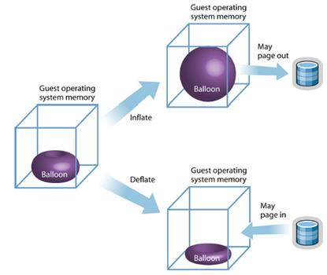
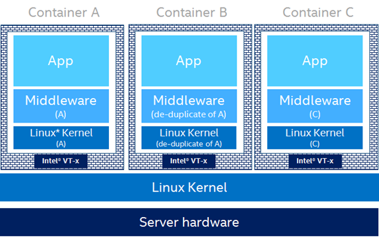

# 虚拟化技术
## 背景
虚拟化作为一套资源使用方式得到了越来越广泛的关注，尤其是近年来随着云计算的高速发展和广泛应用，虚拟化作为云计算核心技术，更是得到了蓬勃发展。所谓虚拟化，是指通过虚拟化技术将一台物理计算机虚拟为多台逻辑计算机。在一台物理机上同时运行多个逻辑计算机，每个逻辑计算机可运行不同的操作系统，并且应用程序都可以在相互独立的空间内运行而互不影响，从而显著提高系统的工作效率。
正是由于虚拟化技术在云计算中的关键地位，如何设计、使用高效的虚拟化方案成为云计算中关注的重点，这也正是我们所关注的。

## 目标
本小组主要关注系统层面的虚拟化管理，如虚拟化环境中的内存管理、IO性能、容器管理等。我们致力于实现虚拟化中高效的内存管理方案和容器管理。

## 内存重删

内存重删技术是虚拟化环境中提升内存利用率的重要技术。内存重删不仅可以为云提供商内存超卖提供技术支持，而且能够提升内存利用率，提升系统性能。因此内存重删不仅在工业界得到广泛应用，在学术界也颇受关注。如何以最小的资源（硬件资源、时间等）开销实现高效、灵敏的内存重删方案一直是业界关注的重点。
实验室郭帆博士提出了一种大小页混合的高效内存重删方案[SmartMD](https://www.usenix.org/conference/atc17/technical-sessions/presentation/guo-fan)，相关论文发表在ATC’17会议上（CCF A类会议）。

## 虚拟机内存回收

内存作为高速的存储设备在存储系统中占据非常重要的地位。由于内存价格昂贵，所以系统的内存大小通常受限（相比与硬盘的TB级，内存往往只有GB级），内存也成为大数据系统的性能瓶颈。因此提升内存利用率具有重要意义。
在虚拟化环境中，由于传统虚拟机的隔离性等特点，主机无法直接从客户机中回收内存，这就导致主机在内存紧张时，无法直接回收虚拟机的空闲内存。为解决此问题，ballooning技术应运而生，正如其名字一样，ballooning如同客户机中的“气球”，它通过控制气球的“充气”和“放气”实现内存在主机和虚拟机之间的动态流动。我们基于ballooning技术分析系统性能瓶颈，旨在优化内存回收过程，提升整体系统性能。

## 安全容器

在传统的容器实现中，不同的容器之间共享使用与主机相同的内核，只在操作系统层面上进行隔离，这就带来了潜在的安全威胁。特别是在多租户环境下，恶意程序可能通过内核漏洞从而对其他用户的程序乃至主机进行攻击。
安全容器则利用虚拟机良好的隔离性，使用轻量化的虚拟机对不同的容器进行隔离，使其能够达到容器的性能表现的同时也能够拥有虚拟机的安全性。我们分析安全容器启动时的时间瓶颈和安全容器的调度，来进一步提升安全容器的性能。